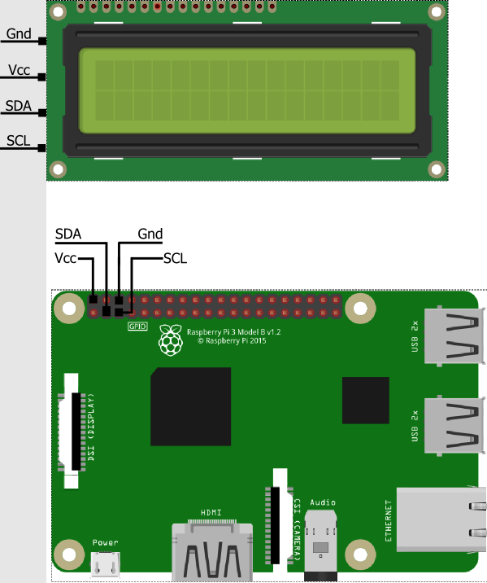
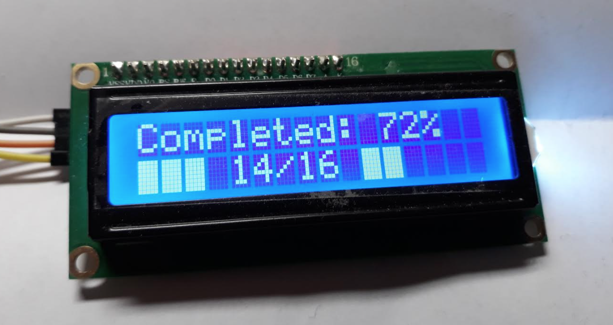
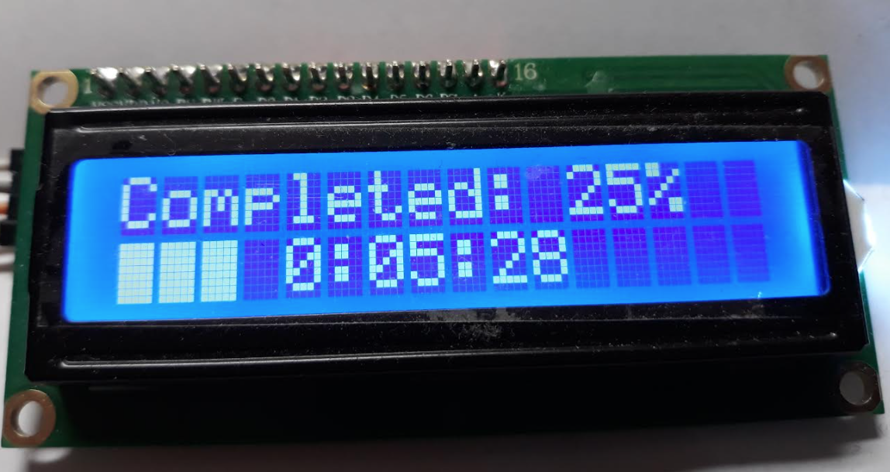

# OctoPrint-Lcd1602

PYTHON3

This plug-in allows you to control a 16X2 lcd display (hd44780 connected to port I2C) to display the octoprint status. 
If [DisplayLayerProgress](https://github.com/OllisGit/OctoPrint-DisplayLayerProgress) is installed it is also possible to display the current layer count.

It is useful for people like me who have a printer without a display.
It indicates on which port the printer is connected, the progress of printing. It also displays the remaining print time (thanks to a simple method).

LCD1602 Plugin for Octoprint
  Written by: n3bojs4
  https://github.com/n3bojs4/octoprint-LCD1602

  Forked on 2021-12-17 by GrooveServer

  Notes: This plugin as written did not support Python 3 (Current default in OctoPrint)
  Modified to support Python 3, removed refrences to fakePi that were causing the plugin to fail to load.

## Hardware - Setup

Youtube video from "Chris's Basement"
https://www.youtube.com/watch?v=302LQo1i2ks

- 16x2 Character Display with a HD44780 controller connected via I2C

### Wiring

Make sure you have i2c enabeld via ```sudo raspi-config```



## OctoPrint - Setup

Install via the bundled [Plugin Manager](https://github.com/foosel/OctoPrint/wiki/Plugin:-Plugin-Manager)
or manually using this URL:

    https://github.com/n3bojs4/OctoPrint-Lcd1602/archive/master.zip

**MANUAL INSTALL:** 

clone the repo :

`git clone https://github.com/n3bojs4/OctoPrint-Lcd1602.git  `

install :

`cd OctoPrint-Lcd1602 && python3 setup.py install`

## Configuration

If you have [DisplayLayerProgress-Plugin](https://plugins.octoprint.org/plugins/DisplayLayerProgress/) installed, 
you can enable the layer output in the plugin settings:


Normally it shows the Progress and the ETA (after 10% progress).
